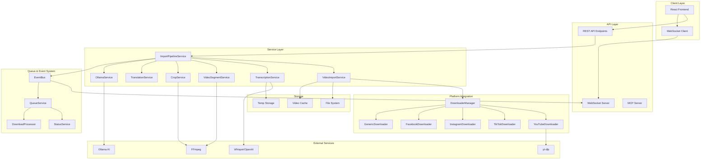
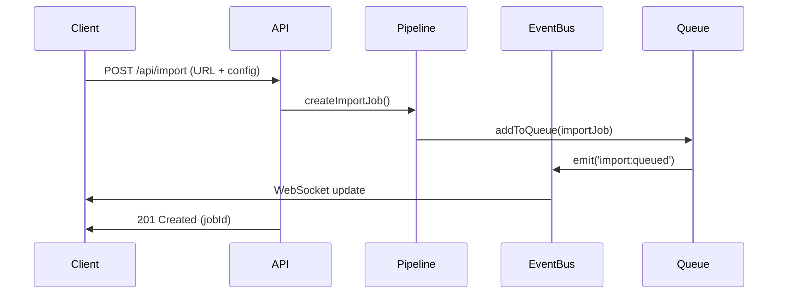
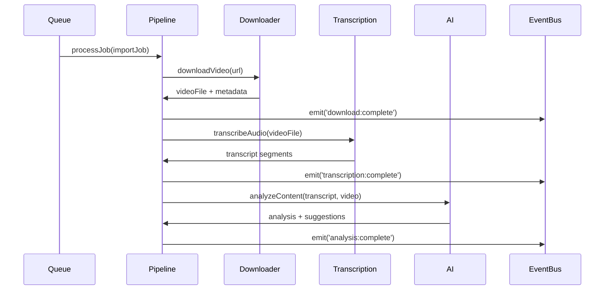
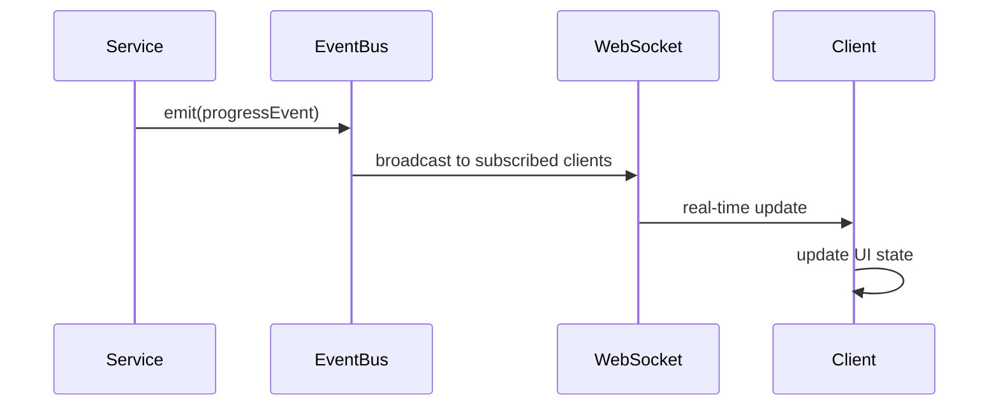
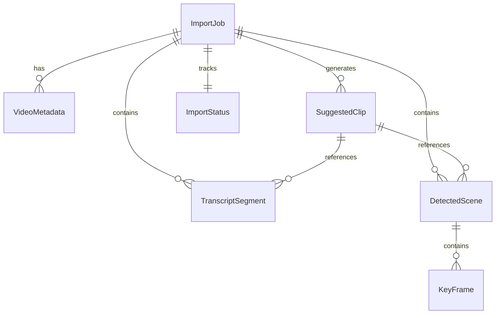

# Architecture Overview - Video Import Feature

## System Architecture

The video import feature is built on an **event-driven microservice architecture** that enables importing videos from multiple platforms, processing them with AI, and converting them into short-form videos.

### High-Level Architecture Diagram



### Component Responsibilities

#### Client Layer
- **React Frontend**: User interface for import management, progress tracking, and video editing
- **WebSocket Client**: Real-time updates for download progress, transcription status, and processing events

#### API Layer
- **REST API Endpoints**: CRUD operations for import jobs, settings management, and system control
- **WebSocket Server**: Real-time bidirectional communication for progress updates
- **MCP Server**: Model Context Protocol server for AI integration

#### Service Layer
- **ImportPipelineService**: Orchestrates the entire import workflow
- **VideoImportService**: Handles video downloads and metadata extraction
- **TranscriptionService**: Audio transcription using Whisper
- **VideoSegmentService**: Video cutting, scene detection, and segment analysis
- **CropService**: Smart cropping and aspect ratio conversion
- **TranslationService**: Multi-language subtitle translation
- **OllamaService**: Local AI integration for content analysis

#### Queue & Event System
- **EventBus**: Central event dispatcher using publish-subscribe pattern
- **QueueService**: Priority-based job queuing with concurrency control
- **StatusService**: Centralized status tracking and progress management
- **DownloadProcessor**: Download orchestration with retry logic

#### Platform Integration
- **DownloaderManager**: Coordinates platform-specific downloaders
- **Platform Downloaders**: Specialized downloaders for each supported platform

## Data Flow Architecture

### 1. Import Initiation Flow



### 2. Video Processing Flow



### 3. Real-time Update Flow



## Service Architecture Patterns

### 1. Event-Driven Pattern

All services communicate through events rather than direct coupling:

```typescript
// Service emits events
class VideoImportService {
  async downloadVideo(url: string): Promise<VideoMetadata> {
    // Download logic...
    
    eventBus.emitDownloadProgress({
      jobId,
      progress: 50,
      downloadedBytes: 1024000,
      totalBytes: 2048000
    });
    
    return metadata;
  }
}

// Other services listen to events
class ImportPipelineService {
  constructor() {
    eventBus.onDownloadProgress(this.handleDownloadProgress.bind(this));
  }
  
  private handleDownloadProgress(event: DownloadProgressEvent) {
    // Update job status and notify clients
  }
}
```

### 2. Strategy Pattern for Platform Support

```typescript
interface VideoDownloader {
  canHandle(url: string): boolean;
  download(url: string, options: DownloadOptions): Promise<DownloadResult>;
  getMetadata(url: string): Promise<VideoMetadata>;
}

class DownloaderManager {
  private downloaders: VideoDownloader[] = [
    new YouTubeDownloader(),
    new TikTokDownloader(),
    new InstagramDownloader(),
    new FacebookDownloader(),
    new GenericDownloader() // Fallback
  ];

  async download(url: string): Promise<DownloadResult> {
    const downloader = this.downloaders.find(d => d.canHandle(url));
    if (!downloader) throw new Error('Unsupported URL');
    return downloader.download(url);
  }
}
```

### 3. Pipeline Pattern for Processing

```typescript
class ImportPipelineService {
  private readonly steps: ProcessingStep[] = [
    new DownloadStep(),
    new TranscriptionStep(),
    new AnalysisStep(),
    new SegmentationStep(),
    new ConversionStep()
  ];

  async processImport(job: ImportJob): Promise<void> {
    for (const step of this.steps) {
      if (!step.isEnabled(job.config)) continue;
      
      await step.execute(job);
      this.updateProgress(job, step.getProgress());
    }
  }
}
```

## Database Architecture (File-Based)

The system uses a **file-based storage approach** with JSON files for persistence:

```
data/
├── imports/                    # Import job data
│   ├── [jobId].json           # Import job metadata
│   └── [jobId]/               # Job-specific files
│       ├── video.mp4          # Original video
│       ├── audio.wav          # Extracted audio
│       ├── transcript.json    # Transcription data
│       ├── analysis.json      # AI analysis results
│       └── segments/          # Video segments
├── status/                    # Status tracking
│   └── [jobId].json          # Status and progress data
├── temp/                      # Temporary processing files
└── video-cache/               # Cached downloaded videos
```

### Data Relationships



## Configuration Architecture

### Environment-Based Configuration

```typescript
// config/import.ts
export const importConfig = {
  // Storage paths
  importDir: process.env.IMPORT_DATA_DIR || './data/imports',
  tempDir: process.env.TEMP_DIR || './data/temp',
  cacheDir: process.env.CACHE_DIR || './data/video-cache',
  
  // Processing limits
  maxConcurrentDownloads: parseInt(process.env.MAX_CONCURRENT_DOWNLOADS || '3'),
  maxFileSize: parseInt(process.env.MAX_FILE_SIZE || '1073741824'), // 1GB
  maxDuration: parseInt(process.env.MAX_DURATION || '3600'), // 1 hour
  
  // AI services
  ollama: {
    baseUrl: process.env.OLLAMA_BASE_URL || 'http://localhost:11434',
    model: process.env.OLLAMA_MODEL || 'llama3.1:8b',
  },
  
  // Transcription
  whisper: {
    model: process.env.WHISPER_MODEL || 'base',
    language: process.env.WHISPER_LANGUAGE || 'auto',
  }
};
```

## Security Architecture

### Input Validation

```typescript
// Zod schema validation
export const videoImportRequestSchema = z.object({
  source: z.nativeEnum(VideoSourceType),
  url: z.string().url().optional(),
  config: z.object({
    transcribe: z.boolean().default(true),
    // ... other config options
  }).optional(),
});
```

### File System Security

- **Sandboxed storage**: All files are stored within designated directories
- **Path traversal prevention**: File paths are validated and sanitized
- **Size limits**: Maximum file sizes are enforced
- **Cleanup policies**: Temporary files are automatically cleaned up

## Scalability Architecture

### Horizontal Scaling Considerations

1. **Stateless Services**: All services are stateless and can be replicated
2. **Event Bus**: Can be replaced with Redis or RabbitMQ for distributed systems
3. **File Storage**: Can be moved to cloud storage (S3, GCS) with minimal changes
4. **Queue System**: Supports distributed queue backends

### Performance Optimization

1. **Lazy Loading**: Resources are loaded only when needed
2. **Caching**: Video files and metadata are cached to avoid re-downloading
3. **Streaming**: Large files are processed in streams to minimize memory usage
4. **Concurrent Processing**: Multiple downloads and processing tasks run concurrently

## Extension Points

### 1. Adding New Platforms

Implement the `VideoDownloader` interface:

```typescript
class NewPlatformDownloader implements VideoDownloader {
  canHandle(url: string): boolean {
    return url.includes('newplatform.com');
  }
  
  async download(url: string, options: DownloadOptions): Promise<DownloadResult> {
    // Platform-specific download logic
  }
  
  async getMetadata(url: string): Promise<VideoMetadata> {
    // Platform-specific metadata extraction
  }
}
```

### 2. Adding New AI Providers

Implement the AI service interface:

```typescript
interface AIService {
  analyzeVideo(transcript: string, metadata: VideoMetadata): Promise<VideoAnalysis>;
  generateSuggestions(analysis: VideoAnalysis): Promise<SuggestedClip[]>;
}
```

### 3. Adding New Processing Steps

Extend the pipeline with custom steps:

```typescript
class CustomProcessingStep implements ProcessingStep {
  async execute(job: ImportJob): Promise<void> {
    // Custom processing logic
  }
  
  isEnabled(config: ImportPipelineConfig): boolean {
    return config.enableCustomStep;
  }
}
```

## Monitoring & Observability

### Event Tracking

All critical operations emit events that can be monitored:

- `import:started`
- `download:progress`
- `transcription:complete`
- `analysis:complete`
- `import:complete`
- `import:failed`

### Metrics Collection

Key metrics are tracked for system monitoring:

- Import success/failure rates
- Processing times per stage
- Queue sizes and processing rates
- Storage usage and cleanup effectiveness
- Error rates by platform and operation

### Logging Strategy

Structured logging with contextual information:

```typescript
logger.info('Video import started', {
  jobId: job.id,
  source: job.source,
  url: job.sourceUrl,
  config: job.config
});
```

## Error Handling Architecture

### 1. Layered Error Handling

- **Service Level**: Individual service errors
- **Pipeline Level**: Workflow orchestration errors  
- **API Level**: Request/response errors
- **Client Level**: UI error handling

### 2. Retry Strategies

- **Exponential Backoff**: For network-related failures
- **Circuit Breaker**: For external service failures
- **Dead Letter Queue**: For permanently failed jobs

### 3. Error Recovery

- **Partial Retry**: Resume from last successful step
- **Cleanup**: Automatic cleanup of failed operations
- **Notification**: Real-time error notifications to clients

This architecture provides a robust, scalable, and maintainable foundation for the video import feature while maintaining clear separation of concerns and extensibility for future enhancements.