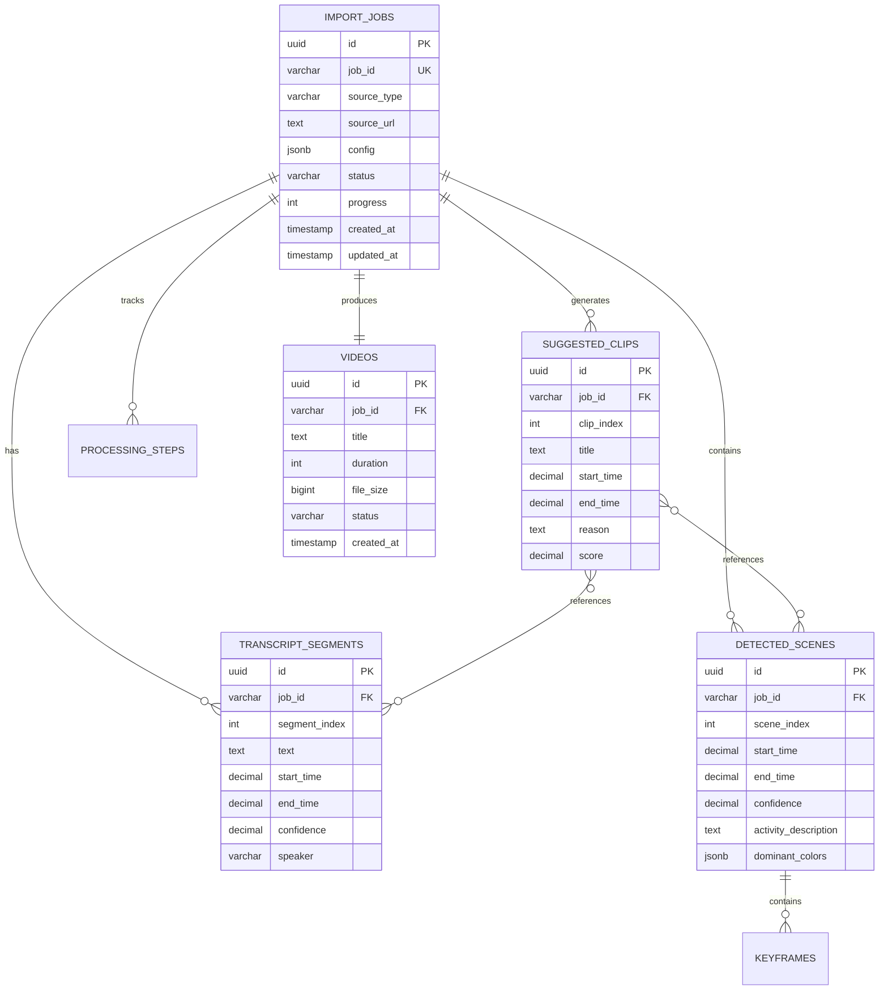

# Database Schema Documentation - Video Import Feature

The video import feature uses a **file-based storage approach** with JSON files for persistence, complemented by PostgreSQL for structured data when needed. This document covers the complete data schema, relationships, and migration strategies.

## Table of Contents

1. [Storage Architecture](#storage-architecture)
2. [File-Based Schema](#file-based-schema)
3. [Database Schema (PostgreSQL)](#database-schema-postgresql)
4. [Data Relationships](#data-relationships)
5. [Migration Strategies](#migration-strategies)
6. [Performance Considerations](#performance-considerations)
7. [Backup and Recovery](#backup-and-recovery)

## Storage Architecture

### Hybrid Storage Approach

The system uses a hybrid approach combining file storage and database storage:

```
Storage Layer Architecture
├── File-Based Storage (Primary)
│   ├── JSON metadata files
│   ├── Video/audio files
│   └── Cache files
└── Database Storage (Secondary)
    ├── User management
    ├── System configuration
    └── Analytics/metrics
```

### Directory Structure

```
data/
├── imports/                    # Import job data
│   ├── [jobId].json           # Job metadata
│   ├── [jobId]/               # Job-specific files
│   │   ├── video.mp4          # Original video
│   │   ├── audio.wav          # Extracted audio
│   │   ├── transcript.json    # Transcription data
│   │   ├── analysis.json      # AI analysis results
│   │   ├── segments/          # Video segments
│   │   │   ├── segment_1.mp4
│   │   │   └── segment_2.mp4
│   │   └── keyframes/         # Extracted keyframes
│   │       ├── frame_001.jpg
│   │       └── frame_002.jpg
├── status/                    # Status tracking
│   └── [jobId].json          # Progress and status
├── temp/                      # Temporary processing files
│   ├── downloads/            # Temporary downloads
│   ├── transcriptions/       # Temporary transcription files
│   └── processing/           # Processing workspace
├── video-cache/               # Cached downloaded videos
│   ├── [hash].mp4           # Cached video file
│   └── [hash].json          # Cache metadata
└── translations/              # Translation cache
    ├── [hash]_en.json
    └── [hash]_es.json
```

## File-Based Schema

### Import Job Schema

**Location**: `data/imports/[jobId].json`

```typescript
interface ImportJob {
  // Basic Information
  id: string;                    // Unique job identifier
  createdAt: string;            // ISO timestamp
  updatedAt: string;            // ISO timestamp
  completedAt?: string;         // ISO timestamp (optional)
  
  // Source Information
  source: VideoSourceType;      // 'youtube', 'tiktok', 'instagram', etc.
  sourceUrl?: string;           // Original URL (if applicable)
  sourceFile?: {                // File upload info (if applicable)
    originalName: string;
    size: number;
    mimeType: string;
  };
  
  // Processing Configuration
  config: ImportPipelineConfig; // Processing options
  
  // Status Information
  status: ImportJobStatus;      // Current status
  progress: number;             // 0-100 percentage
  currentStep?: string;         // Current processing step
  error?: string;               // Error message (if failed)
  
  // Processing Results
  metadata?: VideoMetadata;     // Video metadata
  analysis?: VideoAnalysis;     // AI analysis results
  files?: {                     // Generated files
    video?: string;             // Original video path
    audio?: string;             // Extracted audio path
    transcript?: string;        // Transcript file path
    segments?: string[];        // Video segment paths
    keyframes?: string[];       // Keyframe image paths
  };
  
  // Performance Metrics
  metrics?: {
    downloadTime?: number;      // milliseconds
    transcriptionTime?: number; // milliseconds
    analysisTime?: number;      // milliseconds
    totalProcessingTime?: number; // milliseconds
  };
}
```

**Example**:
```json
{
  "id": "import_2024_001",
  "createdAt": "2024-01-15T10:30:00.000Z",
  "updatedAt": "2024-01-15T10:45:30.000Z",
  "completedAt": "2024-01-15T10:45:30.000Z",
  "source": "youtube",
  "sourceUrl": "https://www.youtube.com/watch?v=dQw4w9WgXcQ",
  "config": {
    "transcribe": true,
    "analyze": true,
    "generateSuggestions": true,
    "extractKeyframes": true,
    "outputFormat": "mp4",
    "targetResolution": "1080p"
  },
  "status": "completed",
  "progress": 100,
  "metadata": {
    "title": "Rick Astley - Never Gonna Give You Up",
    "duration": 212.5,
    "width": 1920,
    "height": 1080,
    "fps": 30,
    "fileSize": 45678901
  },
  "analysis": {
    "transcript": [...],
    "suggestedClips": [...],
    "topics": ["music", "pop", "80s"],
    "keywords": ["never", "gonna", "give", "up"],
    "sentiment": "positive"
  },
  "files": {
    "video": "/data/imports/import_2024_001/video.mp4",
    "audio": "/data/imports/import_2024_001/audio.wav",
    "transcript": "/data/imports/import_2024_001/transcript.json",
    "segments": [
      "/data/imports/import_2024_001/segments/segment_1.mp4",
      "/data/imports/import_2024_001/segments/segment_2.mp4"
    ],
    "keyframes": [
      "/data/imports/import_2024_001/keyframes/frame_001.jpg",
      "/data/imports/import_2024_001/keyframes/frame_002.jpg"
    ]
  },
  "metrics": {
    "downloadTime": 15000,
    "transcriptionTime": 45000,
    "analysisTime": 30000,
    "totalProcessingTime": 90000
  }
}
```

### Status Tracking Schema

**Location**: `data/status/[jobId].json`

```typescript
interface ImportStatus {
  jobId: string;
  status: ImportJobStatus;
  progress: number;
  currentStep: string;
  steps: ProcessingStep[];
  startedAt: string;
  updatedAt: string;
  estimatedCompletion?: string;
  
  // Real-time metrics
  progressHistory: ProgressEntry[];
  errors: ErrorEntry[];
  warnings: WarningEntry[];
}

interface ProcessingStep {
  name: string;
  status: 'pending' | 'in_progress' | 'completed' | 'failed';
  startedAt?: string;
  completedAt?: string;
  progress: number;
  message?: string;
  error?: string;
}

interface ProgressEntry {
  timestamp: string;
  progress: number;
  step: string;
  message?: string;
}
```

### Video Metadata Schema

**Location**: `data/imports/[jobId]/metadata.json`

```typescript
interface VideoMetadata {
  // Basic Properties
  id: string;
  title?: string;
  description?: string;
  duration: number;           // seconds
  fileSize: number;          // bytes
  
  // Technical Properties
  width: number;
  height: number;
  fps?: number;
  bitrate?: number;
  codec?: string;
  format: string;
  
  // Source Information
  originalUrl?: string;
  platform?: string;
  uploadDate?: string;
  creator?: {
    name?: string;
    channel?: string;
    id?: string;
  };
  
  // Engagement Metrics (if available)
  viewCount?: number;
  likeCount?: number;
  commentCount?: number;
  
  // Processing Metadata
  extractedAt: string;
  checksum: string;
  thumbnails?: string[];
  
  // Audio Properties
  audioCodec?: string;
  audioSampleRate?: number;
  audioChannels?: number;
}
```

### Transcript Schema

**Location**: `data/imports/[jobId]/transcript.json`

```typescript
interface TranscriptData {
  jobId: string;
  language: string;
  confidence: number;
  processingTime: number;
  model: string;             // Whisper model used
  segments: TranscriptSegment[];
  
  // Word-level timing (if available)
  words?: WordTiming[];
  
  // Alternative transcriptions
  alternatives?: AlternativeTranscript[];
}

interface TranscriptSegment {
  id: string;
  text: string;
  startTime: number;         // seconds
  endTime: number;           // seconds
  confidence?: number;       // 0-1
  speaker?: string;          // speaker identification
  
  // Word-level data
  words?: {
    word: string;
    startTime: number;
    endTime: number;
    confidence: number;
  }[];
}
```

### Analysis Results Schema

**Location**: `data/imports/[jobId]/analysis.json`

```typescript
interface VideoAnalysisData {
  jobId: string;
  model: string;             // AI model used
  analyzedAt: string;
  processingTime: number;
  
  // Content Analysis
  summary?: string;
  topics: string[];
  keywords: string[];
  sentiment: 'positive' | 'negative' | 'neutral' | 'mixed';
  language: string;
  confidence: number;
  
  // Scene Analysis
  detectedScenes: DetectedScene[];
  
  // Clip Suggestions
  suggestedClips: SuggestedClip[];
  
  // Content Classification
  categories?: string[];
  contentType?: 'educational' | 'entertainment' | 'news' | 'commercial';
  targetAudience?: string;
  
  // Quality Metrics
  videoQuality?: {
    sharpness: number;
    brightness: number;
    contrast: number;
    colorfulness: number;
  };
  
  audioQuality?: {
    clarity: number;
    backgroundNoise: number;
    volume: number;
  };
}
```

## Database Schema (PostgreSQL)

For structured data requiring complex queries, we use PostgreSQL:

### Migration Files

**Location**: `src/database/migrations/`

#### `001_create_videos_table.sql`

```sql
CREATE TABLE videos (
    id UUID PRIMARY KEY DEFAULT gen_random_uuid(),
    job_id VARCHAR(255) UNIQUE NOT NULL,
    title TEXT,
    description TEXT,
    duration DECIMAL(10,3),
    file_size BIGINT,
    width INTEGER,
    height INTEGER,
    fps DECIMAL(6,3),
    format VARCHAR(10),
    source_type VARCHAR(20),
    source_url TEXT,
    status VARCHAR(20) DEFAULT 'pending',
    created_at TIMESTAMP WITH TIME ZONE DEFAULT NOW(),
    updated_at TIMESTAMP WITH TIME ZONE DEFAULT NOW(),
    completed_at TIMESTAMP WITH TIME ZONE,
    
    -- Metadata JSON
    metadata JSONB,
    
    -- File paths
    video_path TEXT,
    audio_path TEXT,
    transcript_path TEXT,
    
    -- Processing metrics
    download_time INTEGER,
    processing_time INTEGER,
    analysis_time INTEGER,
    
    -- Indexes
    CONSTRAINT videos_status_check CHECK (status IN ('pending', 'processing', 'completed', 'failed', 'cancelled'))
);

-- Indexes for performance
CREATE INDEX idx_videos_job_id ON videos(job_id);
CREATE INDEX idx_videos_status ON videos(status);
CREATE INDEX idx_videos_created_at ON videos(created_at DESC);
CREATE INDEX idx_videos_source_type ON videos(source_type);

-- JSONB indexes for metadata queries
CREATE INDEX idx_videos_metadata_gin ON videos USING GIN (metadata);
```

#### `002_create_video_import_tables.sql`

```sql
-- Import jobs table
CREATE TABLE import_jobs (
    id UUID PRIMARY KEY DEFAULT gen_random_uuid(),
    job_id VARCHAR(255) UNIQUE NOT NULL,
    source_type VARCHAR(20) NOT NULL,
    source_url TEXT,
    config JSONB NOT NULL,
    status VARCHAR(20) DEFAULT 'pending',
    progress INTEGER DEFAULT 0,
    current_step TEXT,
    error_message TEXT,
    created_at TIMESTAMP WITH TIME ZONE DEFAULT NOW(),
    updated_at TIMESTAMP WITH TIME ZONE DEFAULT NOW(),
    started_at TIMESTAMP WITH TIME ZONE,
    completed_at TIMESTAMP WITH TIME ZONE,
    
    -- Processing metrics
    metrics JSONB,
    
    CONSTRAINT import_jobs_status_check CHECK (status IN ('pending', 'queued', 'processing', 'completed', 'failed', 'cancelled')),
    CONSTRAINT import_jobs_progress_check CHECK (progress >= 0 AND progress <= 100)
);

-- Transcript segments table
CREATE TABLE transcript_segments (
    id UUID PRIMARY KEY DEFAULT gen_random_uuid(),
    job_id VARCHAR(255) NOT NULL REFERENCES import_jobs(job_id) ON DELETE CASCADE,
    segment_index INTEGER NOT NULL,
    text TEXT NOT NULL,
    start_time DECIMAL(10,3) NOT NULL,
    end_time DECIMAL(10,3) NOT NULL,
    confidence DECIMAL(4,3),
    speaker TEXT,
    language VARCHAR(10),
    
    UNIQUE(job_id, segment_index)
);

-- Detected scenes table
CREATE TABLE detected_scenes (
    id UUID PRIMARY KEY DEFAULT gen_random_uuid(),
    job_id VARCHAR(255) NOT NULL REFERENCES import_jobs(job_id) ON DELETE CASCADE,
    scene_index INTEGER NOT NULL,
    start_time DECIMAL(10,3) NOT NULL,
    end_time DECIMAL(10,3) NOT NULL,
    confidence DECIMAL(4,3),
    activity_description TEXT,
    dominant_colors JSONB,
    keyframes JSONB,
    
    UNIQUE(job_id, scene_index)
);

-- Suggested clips table
CREATE TABLE suggested_clips (
    id UUID PRIMARY KEY DEFAULT gen_random_uuid(),
    job_id VARCHAR(255) NOT NULL REFERENCES import_jobs(job_id) ON DELETE CASCADE,
    clip_index INTEGER NOT NULL,
    title TEXT,
    description TEXT,
    start_time DECIMAL(10,3) NOT NULL,
    end_time DECIMAL(10,3) NOT NULL,
    reason TEXT,
    score DECIMAL(4,3),
    keywords JSONB,
    scene_ids JSONB,
    
    UNIQUE(job_id, clip_index)
);

-- Processing steps log
CREATE TABLE processing_steps (
    id UUID PRIMARY KEY DEFAULT gen_random_uuid(),
    job_id VARCHAR(255) NOT NULL REFERENCES import_jobs(job_id) ON DELETE CASCADE,
    step_name VARCHAR(50) NOT NULL,
    status VARCHAR(20) DEFAULT 'pending',
    started_at TIMESTAMP WITH TIME ZONE,
    completed_at TIMESTAMP WITH TIME ZONE,
    progress INTEGER DEFAULT 0,
    message TEXT,
    error_message TEXT,
    processing_time INTEGER, -- milliseconds
    
    CONSTRAINT processing_steps_status_check CHECK (status IN ('pending', 'in_progress', 'completed', 'failed', 'skipped'))
);

-- System metrics table
CREATE TABLE system_metrics (
    id UUID PRIMARY KEY DEFAULT gen_random_uuid(),
    metric_name VARCHAR(100) NOT NULL,
    metric_value DECIMAL(12,4) NOT NULL,
    metric_unit VARCHAR(20),
    tags JSONB,
    timestamp TIMESTAMP WITH TIME ZONE DEFAULT NOW(),
    
    -- Partition by timestamp for better performance
    CONSTRAINT system_metrics_timestamp_check CHECK (timestamp >= '2024-01-01'::timestamp)
) PARTITION BY RANGE (timestamp);

-- Create partitions for metrics (monthly)
CREATE TABLE system_metrics_2024_01 PARTITION OF system_metrics
FOR VALUES FROM ('2024-01-01') TO ('2024-02-01');

-- Indexes
CREATE INDEX idx_import_jobs_job_id ON import_jobs(job_id);
CREATE INDEX idx_import_jobs_status ON import_jobs(status);
CREATE INDEX idx_import_jobs_created_at ON import_jobs(created_at DESC);
CREATE INDEX idx_import_jobs_source_type ON import_jobs(source_type);

CREATE INDEX idx_transcript_segments_job_id ON transcript_segments(job_id);
CREATE INDEX idx_transcript_segments_time ON transcript_segments(job_id, start_time);

CREATE INDEX idx_detected_scenes_job_id ON detected_scenes(job_id);
CREATE INDEX idx_detected_scenes_time ON detected_scenes(job_id, start_time);

CREATE INDEX idx_suggested_clips_job_id ON suggested_clips(job_id);
CREATE INDEX idx_suggested_clips_score ON suggested_clips(job_id, score DESC);

CREATE INDEX idx_processing_steps_job_id ON processing_steps(job_id);
CREATE INDEX idx_processing_steps_status ON processing_steps(status);

CREATE INDEX idx_system_metrics_name_timestamp ON system_metrics(metric_name, timestamp DESC);
```

### TypeScript Database Types

```typescript
// Database entity types
export interface VideoEntity {
  id: string;
  jobId: string;
  title?: string;
  description?: string;
  duration?: number;
  fileSize?: number;
  width?: number;
  height?: number;
  fps?: number;
  format?: string;
  sourceType: VideoSourceType;
  sourceUrl?: string;
  status: ImportJobStatus;
  createdAt: Date;
  updatedAt: Date;
  completedAt?: Date;
  
  // JSONB fields
  metadata?: Record<string, any>;
  
  // File paths
  videoPath?: string;
  audioPath?: string;
  transcriptPath?: string;
  
  // Metrics
  downloadTime?: number;
  processingTime?: number;
  analysisTime?: number;
}

export interface ImportJobEntity {
  id: string;
  jobId: string;
  sourceType: VideoSourceType;
  sourceUrl?: string;
  config: ImportPipelineConfig;
  status: ImportJobStatus;
  progress: number;
  currentStep?: string;
  errorMessage?: string;
  createdAt: Date;
  updatedAt: Date;
  startedAt?: Date;
  completedAt?: Date;
  metrics?: ProcessingMetrics;
}

export interface TranscriptSegmentEntity {
  id: string;
  jobId: string;
  segmentIndex: number;
  text: string;
  startTime: number;
  endTime: number;
  confidence?: number;
  speaker?: string;
  language?: string;
}
```

## Data Relationships

### Entity Relationship Diagram



### File System Relationships

```
Import Job (import_2024_001)
├── Metadata Files
│   ├── import_2024_001.json          (main job data)
│   ├── status/import_2024_001.json   (status tracking)
│   └── imports/import_2024_001/
│       ├── metadata.json             (video metadata)
│       ├── transcript.json           (transcription data)
│       └── analysis.json             (AI analysis)
├── Media Files
│   ├── video.mp4                     (original video)
│   ├── audio.wav                     (extracted audio)
│   ├── segments/
│   │   ├── segment_001.mp4
│   │   └── segment_002.mp4
│   └── keyframes/
│       ├── frame_001.jpg
│       └── frame_002.jpg
└── Cache References
    ├── video-cache/[hash].mp4         (cached original)
    └── translations/[hash]_en.json    (cached translations)
```

## Migration Strategies

### Database Migrations

```typescript
// Migration runner
class MigrationRunner {
  private migrations: Migration[] = [
    new CreateVideosTables(),
    new CreateImportTables(),
    new AddVideoIndexes(),
    new CreateMetricPartitions()
  ];
  
  async runMigrations(): Promise<void> {
    const db = await this.getDatabase();
    
    // Create migrations table if not exists
    await this.ensureMigrationsTable(db);
    
    for (const migration of this.migrations) {
      const isApplied = await this.isMigrationApplied(db, migration.name);
      
      if (!isApplied) {
        console.log(`Applying migration: ${migration.name}`);
        await migration.up(db);
        await this.recordMigration(db, migration.name);
        console.log(`Migration ${migration.name} applied successfully`);
      }
    }
  }
  
  async rollback(migrationName: string): Promise<void> {
    const db = await this.getDatabase();
    const migration = this.migrations.find(m => m.name === migrationName);
    
    if (!migration) {
      throw new Error(`Migration ${migrationName} not found`);
    }
    
    await migration.down(db);
    await this.removeMigrationRecord(db, migrationName);
  }
}
```

### File Schema Versioning

```typescript
// Schema versioning for JSON files
interface VersionedSchema {
  version: string;
  data: any;
}

class SchemaManager {
  private migrations = new Map<string, SchemaMigration[]>();
  
  constructor() {
    this.registerMigrations();
  }
  
  async migrateData(filePath: string): Promise<any> {
    const rawData = await fs.readFile(filePath, 'utf8');
    let parsedData = JSON.parse(rawData);
    
    // Check if data is versioned
    if (!parsedData.version) {
      parsedData = { version: '1.0.0', data: parsedData };
    }
    
    const currentVersion = parsedData.version;
    const targetVersion = this.getLatestVersion();
    
    if (currentVersion !== targetVersion) {
      parsedData = await this.applyMigrations(parsedData, currentVersion, targetVersion);
      
      // Write back migrated data
      await fs.writeFile(filePath, JSON.stringify(parsedData, null, 2));
    }
    
    return parsedData.data;
  }
  
  private registerMigrations(): void {
    // Migration from 1.0.0 to 1.1.0
    this.migrations.set('1.0.0->1.1.0', [{
      migrate: (data: any) => {
        // Add new fields for enhanced metadata
        if (data.metadata) {
          data.metadata.extractedAt = data.metadata.extractedAt || data.createdAt;
          data.metadata.checksum = data.metadata.checksum || this.calculateChecksum(data);
        }
        return data;
      }
    }]);
    
    // Migration from 1.1.0 to 1.2.0
    this.migrations.set('1.1.0->1.2.0', [{
      migrate: (data: any) => {
        // Restructure analysis data
        if (data.analysis) {
          const oldAnalysis = data.analysis;
          data.analysis = {
            jobId: data.id,
            model: 'llama3.1:8b',
            analyzedAt: new Date().toISOString(),
            ...oldAnalysis
          };
        }
        return data;
      }
    }]);
  }
}
```

## Performance Considerations

### Database Optimization

```sql
-- Partitioning for large tables
ALTER TABLE system_metrics
PARTITION BY RANGE (timestamp);

-- Materialized views for complex queries
CREATE MATERIALIZED VIEW import_statistics AS
SELECT 
    source_type,
    DATE_TRUNC('day', created_at) as date,
    COUNT(*) as total_jobs,
    COUNT(CASE WHEN status = 'completed' THEN 1 END) as completed_jobs,
    AVG(processing_time) as avg_processing_time
FROM import_jobs 
WHERE created_at >= NOW() - INTERVAL '30 days'
GROUP BY source_type, DATE_TRUNC('day', created_at);

-- Refresh materialized view
REFRESH MATERIALIZED VIEW import_statistics;

-- Indexes for common queries
CREATE INDEX CONCURRENTLY idx_import_jobs_status_created 
ON import_jobs(status, created_at) 
WHERE status IN ('pending', 'processing');

-- Partial indexes for active jobs
CREATE INDEX CONCURRENTLY idx_import_jobs_active 
ON import_jobs(created_at) 
WHERE status IN ('pending', 'processing');
```

### File System Performance

```typescript
// Efficient file operations
class FileSystemOptimizer {
  // Batch file operations
  async batchFileOperations(operations: FileOperation[]): Promise<void> {
    const chunks = this.chunkArray(operations, 10);
    
    for (const chunk of chunks) {
      await Promise.all(chunk.map(op => this.executeOperation(op)));
    }
  }
  
  // Streaming for large files
  async streamLargeFile(sourcePath: string, targetPath: string): Promise<void> {
    const readStream = fs.createReadStream(sourcePath);
    const writeStream = fs.createWriteStream(targetPath);
    
    return pipeline(readStream, writeStream);
  }
  
  // Lazy loading of metadata
  async loadMetadataOnDemand(jobId: string): Promise<VideoMetadata> {
    const cacheKey = `metadata:${jobId}`;
    
    let metadata = this.memoryCache.get(cacheKey);
    if (!metadata) {
      const metadataPath = path.join(this.getJobDirectory(jobId), 'metadata.json');
      metadata = JSON.parse(await fs.readFile(metadataPath, 'utf8'));
      this.memoryCache.set(cacheKey, metadata);
    }
    
    return metadata;
  }
}
```

## Backup and Recovery

### Backup Strategy

```typescript
class BackupService {
  async createBackup(): Promise<string> {
    const backupId = `backup_${Date.now()}`;
    const backupDir = path.join('./backups', backupId);
    
    await fs.mkdir(backupDir, { recursive: true });
    
    // Backup database
    await this.backupDatabase(backupDir);
    
    // Backup file data
    await this.backupFileData(backupDir);
    
    // Create backup manifest
    await this.createBackupManifest(backupDir);
    
    return backupId;
  }
  
  private async backupDatabase(backupDir: string): Promise<void> {
    const dumpFile = path.join(backupDir, 'database.sql');
    
    await execAsync(`pg_dump ${process.env.DATABASE_URL} > ${dumpFile}`);
  }
  
  private async backupFileData(backupDir: string): Promise<void> {
    const dataBackupDir = path.join(backupDir, 'data');
    
    // Copy critical data directories
    await this.copyDirectory('./data/imports', path.join(dataBackupDir, 'imports'));
    await this.copyDirectory('./data/status', path.join(dataBackupDir, 'status'));
    
    // Compress video cache (optional)
    await this.compressDirectory('./data/video-cache', path.join(dataBackupDir, 'video-cache.tar.gz'));
  }
  
  private async createBackupManifest(backupDir: string): Promise<void> {
    const manifest = {
      backupId: path.basename(backupDir),
      createdAt: new Date().toISOString(),
      version: await this.getApplicationVersion(),
      files: await this.getBackupFileList(backupDir),
      checksum: await this.calculateDirectoryChecksum(backupDir)
    };
    
    await fs.writeFile(
      path.join(backupDir, 'manifest.json'),
      JSON.stringify(manifest, null, 2)
    );
  }
}
```

### Recovery Procedures

```typescript
class RecoveryService {
  async restoreFromBackup(backupId: string): Promise<void> {
    const backupDir = path.join('./backups', backupId);
    
    // Verify backup integrity
    await this.verifyBackupIntegrity(backupDir);
    
    // Stop application services
    await this.stopServices();
    
    try {
      // Restore database
      await this.restoreDatabase(backupDir);
      
      // Restore file data
      await this.restoreFileData(backupDir);
      
      // Verify restoration
      await this.verifyRestoration();
      
    } finally {
      // Restart services
      await this.startServices();
    }
  }
  
  private async restoreDatabase(backupDir: string): Promise<void> {
    const dumpFile = path.join(backupDir, 'database.sql');
    
    // Drop existing database and recreate
    await execAsync(`dropdb ${this.getDatabaseName()}`);
    await execAsync(`createdb ${this.getDatabaseName()}`);
    
    // Restore from dump
    await execAsync(`psql ${process.env.DATABASE_URL} < ${dumpFile}`);
  }
  
  private async restoreFileData(backupDir: string): Promise<void> {
    const dataBackupDir = path.join(backupDir, 'data');
    
    // Clear existing data
    await fs.rm('./data/imports', { recursive: true, force: true });
    await fs.rm('./data/status', { recursive: true, force: true });
    
    // Restore from backup
    await this.copyDirectory(path.join(dataBackupDir, 'imports'), './data/imports');
    await this.copyDirectory(path.join(dataBackupDir, 'status'), './data/status');
    
    // Restore compressed cache if exists
    const cacheArchive = path.join(dataBackupDir, 'video-cache.tar.gz');
    if (await this.fileExists(cacheArchive)) {
      await this.extractArchive(cacheArchive, './data/video-cache');
    }
  }
}
```

This comprehensive database schema documentation provides the foundation for understanding data storage, relationships, and management in the video import feature. The hybrid approach of file-based and database storage offers flexibility, performance, and scalability for different types of data and use cases.