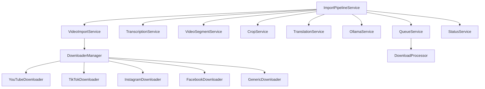

# Service Documentation - Video Import Feature

This document provides comprehensive documentation for all services in the video import feature, including their methods, usage examples, and integration patterns.

## Core Services Overview



## 1. ImportPipelineService

**Location**: `src/services/ImportPipelineService.ts`

The main orchestration service that manages the complete video import workflow.

### Class Definition

```typescript
class ImportPipelineService {
  constructor(
    private videoImportService: VideoImportService,
    private transcriptionService: TranscriptionService,
    private videoSegmentService: VideoSegmentService,
    private cropService: CropService,
    private translationService: TranslationService,
    private ollamaService: OllamaService,
    private eventBus: EventBus
  );
  
  // Main methods
  async createImportJob(request: VideoImportRequest): Promise<ImportJob>;
  async processImportJob(jobId: string): Promise<void>;
  async cancelImportJob(jobId: string): Promise<void>;
  async getImportJob(jobId: string): Promise<ImportJob | null>;
  async listImportJobs(filters?: ImportJobFilters): Promise<ImportJob[]>;
  async retryFailedJob(jobId: string): Promise<void>;
  async deleteImportJob(jobId: string): Promise<void>;
  
  // Status and progress
  async getJobStatus(jobId: string): Promise<ImportJobStatus>;
  async getJobProgress(jobId: string): Promise<number>;
  
  // Utility methods
  async validateImportRequest(request: VideoImportRequest): Promise<ValidationResult>;
  async estimateProcessingTime(request: VideoImportRequest): Promise<number>;
}
```

### Key Methods

#### `createImportJob(request: VideoImportRequest): Promise<ImportJob>`

Creates a new import job and adds it to the processing queue.

```typescript
// Usage example
const pipeline = new ImportPipelineService(/* dependencies */);

const importRequest: VideoImportRequest = {
  source: VideoSourceType.YOUTUBE,
  url: 'https://www.youtube.com/watch?v=dQw4w9WgXcQ',
  config: {
    transcribe: true,
    detectScenes: true,
    analyze: true,
    generateSuggestions: true,
    extractKeyframes: true,
    generateThumbnails: true,
    outputFormat: 'mp4',
    targetResolution: '1080p'
  }
};

try {
  const job = await pipeline.createImportJob(importRequest);
  console.log(`Import job created: ${job.id}`);
  
  // Listen for progress updates
  eventBus.onVideoStatusUpdate((event) => {
    if (event.videoId === job.id) {
      console.log(`Progress: ${event.progress}%`);
    }
  });
} catch (error) {
  console.error('Failed to create import job:', error);
}
```

#### `processImportJob(jobId: string): Promise<void>`

Processes an import job through all pipeline stages.

```typescript
// Internal processing pipeline
async processImportJob(jobId: string): Promise<void> {
  const job = await this.getImportJob(jobId);
  if (!job) throw new Error('Import job not found');

  try {
    // Stage 1: Download video
    await this.downloadStage(job);
    
    // Stage 2: Extract audio and transcribe (if enabled)
    if (job.config.transcribe) {
      await this.transcriptionStage(job);
    }
    
    // Stage 3: Scene detection (if enabled)
    if (job.config.detectScenes) {
      await this.sceneDetectionStage(job);
    }
    
    // Stage 4: AI analysis (if enabled)
    if (job.config.analyze) {
      await this.analysisStage(job);
    }
    
    // Stage 5: Generate suggestions (if enabled)
    if (job.config.generateSuggestions) {
      await this.suggestionStage(job);
    }
    
    // Stage 6: Finalize
    await this.finalizationStage(job);
    
  } catch (error) {
    await this.handleJobError(job, error);
  }
}
```

### Event Integration

The service emits events at each stage:

```typescript
// Progress events
this.eventBus.emitVideoStatusUpdate({
  videoId: job.id,
  status: 'processing',
  progress: 50,
  message: 'Transcribing audio...',
  timestamp: new Date().toISOString()
});

// Completion events
this.eventBus.emitVideoCompleted({
  videoId: job.id,
  result: job.analysis,
  timestamp: new Date().toISOString()
});
```

## 2. VideoImportService

**Location**: `src/services/VideoImportService.ts`

Handles video downloads and metadata extraction from various platforms.

### Class Definition

```typescript
class VideoImportService {
  constructor(
    private downloaderManager: DownloaderManager,
    private eventBus: EventBus,
    private config: ImportConfig
  );
  
  // Download methods
  async downloadVideo(url: string, options: DownloadOptions): Promise<DownloadResult>;
  async getVideoMetadata(url: string): Promise<VideoMetadata>;
  async validateUrl(url: string): Promise<ValidationResult>;
  
  // Platform detection
  detectPlatform(url: string): VideoSourceType;
  getSupportedPlatforms(): VideoSourceType[];
  
  // Cache management
  async getCachedVideo(url: string): Promise<CachedVideo | null>;
  async clearCache(olderThan?: Date): Promise<number>;
  
  // Utility methods
  async extractAudio(videoPath: string): Promise<string>;
  async generateThumbnail(videoPath: string, timestamp: number): Promise<string>;
  async getVideoDuration(videoPath: string): Promise<number>;
}
```

### Usage Examples

#### Basic Video Download

```typescript
const videoImportService = new VideoImportService(/* dependencies */);

// Download with progress tracking
const result = await videoImportService.downloadVideo(
  'https://www.youtube.com/watch?v=dQw4w9WgXcQ',
  {
    quality: 'best',
    format: 'mp4',
    outputDir: './downloads',
    onProgress: (progress) => {
      console.log(`Download progress: ${progress}%`);
    }
  }
);

console.log('Download completed:', result.filePath);
console.log('Video metadata:', result.metadata);
```

#### Platform Detection

```typescript
// Automatic platform detection
const platforms = [
  'https://www.youtube.com/watch?v=dQw4w9WgXcQ',
  'https://www.tiktok.com/@user/video/1234567890',
  'https://www.instagram.com/p/ABC123/',
  'https://www.facebook.com/watch/?v=1234567890'
];

for (const url of platforms) {
  const platform = videoImportService.detectPlatform(url);
  console.log(`${url} -> ${platform}`);
}
```

#### Cache Management

```typescript
// Check for cached video
const cached = await videoImportService.getCachedVideo(url);
if (cached) {
  console.log('Using cached video:', cached.filePath);
} else {
  const result = await videoImportService.downloadVideo(url);
  console.log('Downloaded new video:', result.filePath);
}

// Clean up old cached files (older than 7 days)
const sevenDaysAgo = new Date(Date.now() - 7 * 24 * 60 * 60 * 1000);
const removed = await videoImportService.clearCache(sevenDaysAgo);
console.log(`Removed ${removed} cached files`);
```

## 3. TranscriptionService

**Location**: `src/services/TranscriptionService.ts`

Handles audio transcription using Whisper or other transcription providers.

### Class Definition

```typescript
interface TranscriptionProvider {
  name: string;
  transcribe(audioPath: string, options: TranscriptionOptions): Promise<TranscriptSegment[]>;
  isAvailable(): Promise<boolean>;
  getSupportedLanguages(): string[];
}

class TranscriptionService {
  constructor(
    private providers: TranscriptionProvider[],
    private config: TranscriptionConfig
  );
  
  // Core methods
  async transcribeAudio(audioPath: string, options?: TranscriptionOptions): Promise<TranscriptSegment[]>;
  async detectLanguage(audioPath: string): Promise<string>;
  async translateTranscript(segments: TranscriptSegment[], targetLanguage: string): Promise<TranscriptSegment[]>;
  
  // Provider management
  async getAvailableProviders(): Promise<TranscriptionProvider[]>;
  setPreferredProvider(providerName: string): void;
  
  // Utility methods
  async exportTranscript(segments: TranscriptSegment[], format: 'srt' | 'vtt' | 'txt'): Promise<string>;
  async mergeSegments(segments: TranscriptSegment[], maxGap: number): Promise<TranscriptSegment[]>;
  async filterByConfidence(segments: TranscriptSegment[], minConfidence: number): Promise<TranscriptSegment[]>;
}
```

### Usage Examples

#### Basic Transcription

```typescript
const transcriptionService = new TranscriptionService(/* dependencies */);

// Transcribe audio file
const segments = await transcriptionService.transcribeAudio(
  './audio/interview.wav',
  {
    language: 'en',
    model: 'base',
    enableTimestamps: true,
    enableWordTimestamps: true
  }
);

// Process results
segments.forEach((segment, index) => {
  console.log(`Segment ${index + 1}: ${segment.startTime}s - ${segment.endTime}s`);
  console.log(`Text: ${segment.text}`);
  console.log(`Confidence: ${segment.confidence}`);
  console.log('---');
});
```

#### Language Detection and Translation

```typescript
// Detect language first
const detectedLanguage = await transcriptionService.detectLanguage('./audio/speech.wav');
console.log(`Detected language: ${detectedLanguage}`);

// Transcribe in detected language
const originalSegments = await transcriptionService.transcribeAudio(
  './audio/speech.wav',
  { language: detectedLanguage }
);

// Translate to English
const translatedSegments = await transcriptionService.translateTranscript(
  originalSegments,
  'en'
);

console.log('Original:', originalSegments[0].text);
console.log('Translated:', translatedSegments[0].text);
```

#### Export Transcripts

```typescript
// Export as different formats
const segments = await transcriptionService.transcribeAudio('./audio/lecture.wav');

// Export as SRT subtitle file
const srtContent = await transcriptionService.exportTranscript(segments, 'srt');
await fs.writeFile('./output/lecture.srt', srtContent);

// Export as plain text
const textContent = await transcriptionService.exportTranscript(segments, 'txt');
await fs.writeFile('./output/lecture.txt', textContent);
```

## 4. VideoSegmentService

**Location**: `src/services/VideoSegmentService.ts`

Handles video segmentation, scene detection, and clip extraction.

### Class Definition

```typescript
class VideoSegmentService {
  constructor(
    private ffmpegService: FFmpegService,
    private eventBus: EventBus
  );
  
  // Scene detection
  async detectScenes(videoPath: string, options?: SceneDetectionOptions): Promise<DetectedScene[]>;
  async extractKeyframes(videoPath: string, scenes: DetectedScene[]): Promise<string[]>;
  
  // Video cutting
  async extractSegment(videoPath: string, startTime: number, endTime: number, outputPath?: string): Promise<string>;
  async cutVideo(videoPath: string, segments: TimeSegment[]): Promise<string[]>;
  
  // Analysis
  async analyzeVideoContent(videoPath: string): Promise<VideoContentAnalysis>;
  async detectObjects(videoPath: string, frameInterval?: number): Promise<ObjectDetection[]>;
  async calculateVideoComplexity(videoPath: string): Promise<ComplexityScore>;
  
  // Utility methods
  async getVideoInfo(videoPath: string): Promise<VideoInfo>;
  async generatePreview(videoPath: string, maxDuration: number): Promise<string>;
  async createVideoMontage(segments: VideoSegment[]): Promise<string>;
}
```

### Usage Examples

#### Scene Detection

```typescript
const videoSegmentService = new VideoSegmentService(/* dependencies */);

// Detect scenes with custom threshold
const scenes = await videoSegmentService.detectScenes(
  './video/movie.mp4',
  {
    threshold: 0.3,
    minSceneLength: 5.0,
    maxScenes: 20
  }
);

// Extract keyframes for each scene
for (const scene of scenes) {
  const keyframes = await videoSegmentService.extractKeyframes(
    './video/movie.mp4',
    [scene]
  );
  
  console.log(`Scene ${scene.id}: ${scene.startTime}s - ${scene.endTime}s`);
  console.log(`Keyframes: ${keyframes.length}`);
}
```

#### Video Cutting

```typescript
// Extract specific segments
const segments = [
  { startTime: 10, endTime: 30, name: 'intro' },
  { startTime: 45, endTime: 75, name: 'main_point' },
  { startTime: 90, endTime: 120, name: 'conclusion' }
];

const outputFiles = await videoSegmentService.cutVideo(
  './video/presentation.mp4',
  segments
);

outputFiles.forEach((file, index) => {
  console.log(`Segment ${segments[index].name}: ${file}`);
});
```

#### Content Analysis

```typescript
// Analyze video content
const analysis = await videoSegmentService.analyzeVideoContent('./video/content.mp4');

console.log('Video Analysis:');
console.log(`Duration: ${analysis.duration}s`);
console.log(`Dominant colors: ${analysis.dominantColors.join(', ')}`);
console.log(`Activity level: ${analysis.activityLevel}`);
console.log(`Detected objects: ${analysis.objects.join(', ')}`);
console.log(`Complexity score: ${analysis.complexityScore}`);
```

## 5. CropService

**Location**: `src/services/CropService.ts`

Handles smart cropping and aspect ratio conversion for different platforms.

### Class Definition

```typescript
interface CropRegion {
  x: number;
  y: number;
  width: number;
  height: number;
  confidence: number;
}

class CropService {
  constructor(
    private ffmpegService: FFmpegService,
    private aiService?: AIService
  );
  
  // Smart cropping
  async smartCrop(videoPath: string, targetAspectRatio: AspectRatio): Promise<string>;
  async detectImportantRegions(videoPath: string): Promise<CropRegion[]>;
  async cropToRegion(videoPath: string, region: CropRegion): Promise<string>;
  
  // Aspect ratio conversion
  async convertAspectRatio(videoPath: string, targetRatio: AspectRatio, method: CropMethod): Promise<string>;
  async addPadding(videoPath: string, targetRatio: AspectRatio, paddingColor?: string): Promise<string>;
  
  // Platform-specific crops
  async cropForTikTok(videoPath: string): Promise<string>;
  async cropForInstagram(videoPath: string, format: 'story' | 'reel' | 'post'): Promise<string>;
  async cropForYouTubeShorts(videoPath: string): Promise<string>;
  
  // Analysis methods
  async analyzeFaces(videoPath: string): Promise<FaceDetection[]>;
  async analyzeText(videoPath: string): Promise<TextDetection[]>;
  async calculateFocusPoints(videoPath: string): Promise<Point[]>;
}
```

### Usage Examples

#### Smart Cropping

```typescript
const cropService = new CropService(/* dependencies */);

// Smart crop to vertical format (9:16) for TikTok/Instagram Stories
const verticalVideo = await cropService.smartCrop(
  './video/landscape.mp4',
  AspectRatio.VERTICAL_9_16
);

console.log('Vertical video created:', verticalVideo);

// Smart crop to square format (1:1) for Instagram posts
const squareVideo = await cropService.smartCrop(
  './video/landscape.mp4',
  AspectRatio.SQUARE_1_1
);

console.log('Square video created:', squareVideo);
```

#### Platform-Specific Cropping

```typescript
// Optimize for different platforms
const originalVideo = './video/content.mp4';

// TikTok optimization (9:16 with smart focus)
const tiktokVideo = await cropService.cropForTikTok(originalVideo);

// Instagram Stories optimization
const storyVideo = await cropService.cropForInstagram(originalVideo, 'story');

// YouTube Shorts optimization
const shortsVideo = await cropService.cropForYouTubeShorts(originalVideo);

console.log('Platform-optimized videos created:');
console.log(`TikTok: ${tiktokVideo}`);
console.log(`Instagram Story: ${storyVideo}`);
console.log(`YouTube Shorts: ${shortsVideo}`);
```

#### Advanced Analysis

```typescript
// Analyze video for smart cropping decisions
const faces = await cropService.analyzeFaces('./video/interview.mp4');
const textRegions = await cropService.analyzeText('./video/presentation.mp4');
const focusPoints = await cropService.calculateFocusPoints('./video/action.mp4');

console.log(`Detected ${faces.length} faces`);
console.log(`Found ${textRegions.length} text regions`);
console.log(`Calculated ${focusPoints.length} focus points`);

// Use analysis for custom cropping
const importantRegions = await cropService.detectImportantRegions('./video/complex.mp4');
const bestRegion = importantRegions.sort((a, b) => b.confidence - a.confidence)[0];

if (bestRegion) {
  const croppedVideo = await cropService.cropToRegion('./video/complex.mp4', bestRegion);
  console.log('Custom cropped video:', croppedVideo);
}
```

## 6. TranslationService

**Location**: `src/services/TranslationService.ts`

Handles translation of transcripts and subtitle generation.

### Class Definition

```typescript
interface TranslationProvider {
  name: string;
  translate(text: string, from: string, to: string): Promise<string>;
  detectLanguage(text: string): Promise<string>;
  getSupportedLanguages(): Promise<Language[]>;
  isAvailable(): Promise<boolean>;
}

class TranslationService {
  constructor(
    private providers: TranslationProvider[],
    private config: TranslationConfig
  );
  
  // Translation methods
  async translateText(text: string, targetLanguage: string, sourceLanguage?: string): Promise<string>;
  async translateSegments(segments: TranscriptSegment[], targetLanguage: string): Promise<TranscriptSegment[]>;
  async batchTranslate(texts: string[], targetLanguage: string): Promise<string[]>;
  
  // Language detection
  async detectLanguage(text: string): Promise<string>;
  async detectSegmentLanguages(segments: TranscriptSegment[]): Promise<string[]>;
  
  // Subtitle generation
  async generateSubtitles(segments: TranscriptSegment[], options: SubtitleOptions): Promise<string>;
  async createMultiLanguageSubtitles(segments: TranscriptSegment[], languages: string[]): Promise<Record<string, string>>;
  
  // Provider management
  setProvider(providerName: string): void;
  async getAvailableProviders(): Promise<TranslationProvider[]>;
  async getSupportedLanguages(): Promise<Language[]>;
}
```

### Usage Examples

#### Basic Translation

```typescript
const translationService = new TranslationService(/* dependencies */);

// Translate single text
const translatedText = await translationService.translateText(
  'Hello, how are you?',
  'es' // Spanish
);
console.log(translatedText); // "Hola, ¿cómo estás?"

// Translate transcript segments
const originalSegments: TranscriptSegment[] = [
  { text: 'Welcome to our tutorial', startTime: 0, endTime: 3 },
  { text: 'Today we will learn about React', startTime: 3, endTime: 6 }
];

const spanishSegments = await translationService.translateSegments(
  originalSegments,
  'es'
);

spanishSegments.forEach(segment => {
  console.log(`${segment.startTime}s: ${segment.text}`);
});
```

#### Multi-Language Subtitles

```typescript
// Generate subtitles in multiple languages
const transcript = await transcriptionService.transcribeAudio('./audio/lecture.wav');

const multiLangSubtitles = await translationService.createMultiLanguageSubtitles(
  transcript,
  ['es', 'fr', 'de', 'pt']
);

// Save subtitle files
for (const [lang, content] of Object.entries(multiLangSubtitles)) {
  await fs.writeFile(`./subtitles/lecture_${lang}.srt`, content);
  console.log(`Created subtitles in ${lang}`);
}
```

#### Language Detection

```typescript
// Detect language of transcript
const mixedLanguageSegments = [
  { text: 'Hello everyone', startTime: 0, endTime: 2 },
  { text: 'Bonjour tout le monde', startTime: 2, endTime: 4 },
  { text: 'Hola a todos', startTime: 4, endTime: 6 }
];

const detectedLanguages = await translationService.detectSegmentLanguages(mixedLanguageSegments);
detectedLanguages.forEach((lang, index) => {
  console.log(`Segment ${index}: ${mixedLanguageSegments[index].text} -> ${lang}`);
});
```

## 7. OllamaService

**Location**: `src/services/OllamaService.ts`

Provides local AI integration using Ollama for content analysis and suggestions.

### Class Definition

```typescript
class OllamaService {
  constructor(
    private config: OllamaConfig,
    private httpClient: HttpClient
  );
  
  // Model management
  async listModels(): Promise<OllamaModel[]>;
  async pullModel(modelName: string): Promise<void>;
  async deleteModel(modelName: string): Promise<void>;
  async isModelAvailable(modelName: string): Promise<boolean>;
  
  // Content analysis
  async analyzeTranscript(transcript: TranscriptSegment[], prompt?: string): Promise<VideoAnalysis>;
  async generateSuggestions(analysis: VideoAnalysis, maxSuggestions: number): Promise<SuggestedClip[]>;
  async summarizeContent(transcript: TranscriptSegment[]): Promise<string>;
  async extractKeywords(text: string): Promise<string[]>;
  async detectSentiment(text: string): Promise<'positive' | 'negative' | 'neutral' | 'mixed'>;
  
  // Custom prompts
  async generate(prompt: string, options?: GenerateOptions): Promise<string>;
  async generateStructured<T>(prompt: string, schema: ZodSchema<T>): Promise<T>;
  
  // Health and status
  async isHealthy(): Promise<boolean>;
  async getServerInfo(): Promise<OllamaServerInfo>;
}
```

### Usage Examples

#### Content Analysis

```typescript
const ollamaService = new OllamaService(/* dependencies */);

// Analyze video transcript
const transcript = await transcriptionService.transcribeAudio('./audio/podcast.wav');

const analysis = await ollamaService.analyzeTranscript(transcript);

console.log('Content Analysis:');
console.log(`Summary: ${analysis.summary}`);
console.log(`Topics: ${analysis.topics.join(', ')}`);
console.log(`Keywords: ${analysis.keywords.join(', ')}`);
console.log(`Sentiment: ${analysis.sentiment}`);
console.log(`Language: ${analysis.language}`);

// Generate clip suggestions
const suggestions = await ollamaService.generateSuggestions(analysis, 5);

suggestions.forEach((suggestion, index) => {
  console.log(`\nSuggestion ${index + 1}:`);
  console.log(`Title: ${suggestion.title}`);
  console.log(`Time: ${suggestion.startTime}s - ${suggestion.endTime}s`);
  console.log(`Reason: ${suggestion.reason}`);
  console.log(`Score: ${suggestion.score}`);
});
```

#### Custom Analysis Prompts

```typescript
// Custom analysis with structured output
const analysisSchema = z.object({
  mainTopics: z.array(z.string()),
  keyMoments: z.array(z.object({
    timestamp: z.number(),
    description: z.string(),
    importance: z.number()
  })),
  targetAudience: z.string(),
  engagementPotential: z.number().min(1).max(10)
});

const customAnalysis = await ollamaService.generateStructured(
  `Analyze this video transcript for social media engagement potential: ${transcriptText}`,
  analysisSchema
);

console.log('Custom Analysis:');
console.log(`Main Topics: ${customAnalysis.mainTopics.join(', ')}`);
console.log(`Target Audience: ${customAnalysis.targetAudience}`);
console.log(`Engagement Potential: ${customAnalysis.engagementPotential}/10`);
```

#### Model Management

```typescript
// Check available models
const models = await ollamaService.listModels();
console.log('Available models:', models.map(m => m.name));

// Ensure required model is available
const requiredModel = 'llama3.1:8b';
const isAvailable = await ollamaService.isModelAvailable(requiredModel);

if (!isAvailable) {
  console.log(`Pulling model: ${requiredModel}`);
  await ollamaService.pullModel(requiredModel);
  console.log('Model pulled successfully');
}

// Check service health
const isHealthy = await ollamaService.isHealthy();
if (!isHealthy) {
  throw new Error('Ollama service is not available');
}
```

## Supporting Services

### QueueService Integration

```typescript
// Queue service integration example
class ImportPipelineService {
  async createImportJob(request: VideoImportRequest): Promise<ImportJob> {
    const job = this.createJobFromRequest(request);
    
    // Add to queue with appropriate priority
    await this.queueService.addJob(job, {
      priority: this.determinePriority(request),
      maxRetries: 3,
      retryDelay: 5000
    });
    
    return job;
  }
  
  private determinePriority(request: VideoImportRequest): QueuePriority {
    // Determine priority based on user tier, file size, etc.
    if (request.urgent) return QueuePriority.HIGH;
    if (request.config?.analyze) return QueuePriority.NORMAL;
    return QueuePriority.LOW;
  }
}
```

### StatusService Integration

```typescript
// Status tracking throughout the pipeline
class ImportPipelineService {
  private async updateJobProgress(job: ImportJob, stage: string, progress: number) {
    await this.statusService.updateStatus(job.id, {
      status: 'processing',
      progress,
      currentStep: stage,
      updatedAt: new Date()
    });
    
    // Emit event for real-time updates
    this.eventBus.emitVideoStatusUpdate({
      videoId: job.id,
      status: 'processing',
      progress,
      message: `${stage}: ${progress}%`,
      timestamp: new Date().toISOString()
    });
  }
}
```

### Error Handling Patterns

```typescript
// Consistent error handling across services
class BaseService {
  protected async handleError(operation: string, error: any): Promise<never> {
    const errorMessage = `${operation} failed: ${error.message}`;
    
    // Log error with context
    logger.error(errorMessage, {
      service: this.constructor.name,
      operation,
      error: error.stack,
      timestamp: new Date().toISOString()
    });
    
    // Emit error event
    this.eventBus.emitVideoError({
      videoId: this.currentJobId,
      error: errorMessage,
      timestamp: new Date().toISOString()
    });
    
    throw new ServiceError(errorMessage, error);
  }
}
```

This comprehensive service documentation provides developers with all the information needed to understand, use, and extend the video import feature services. Each service is designed to be modular, testable, and easily integrated with the broader system architecture.